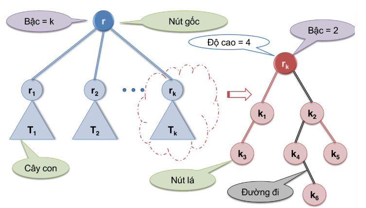

Binary Tree (cây nhị phân) :

___
### Level/ Depth (độ sâu)

- Mọi node đều có level của nó. Ở Btree, Max số node ở level 'l'  là `2^l`.
VD :  
*Ở level 2 thì cây có tối đa 2^2 = 4 node.*

___
### Degree (bậc)

- Bậc 1 node là số child của 1 node.
- Bậc của cây là bậc lớn nhất trong các con `(B_tree thì là 2)`.

___
### Height (Chiều cao)

- Khái niệm của cây, chỉ độ sâu lớn nhất của các node con. 

_Tính = `số đường dẫn tới node + 1`_
- 1 cây độ cao h thì tối đa có `2^h - 1` nodes. 

___
**1 cây N node thì ít nhất có số level min / chiều cao min  là  `Log(N+1)`**

N <= 2^h - 1

___

## Cây cân bằng
__In a balanced binary tree, the height of the left and right subtrees of every node differ by at most 1.__
> *1 cây cân bằng có cây con trái chênh với cây con phải tối đa 1.*